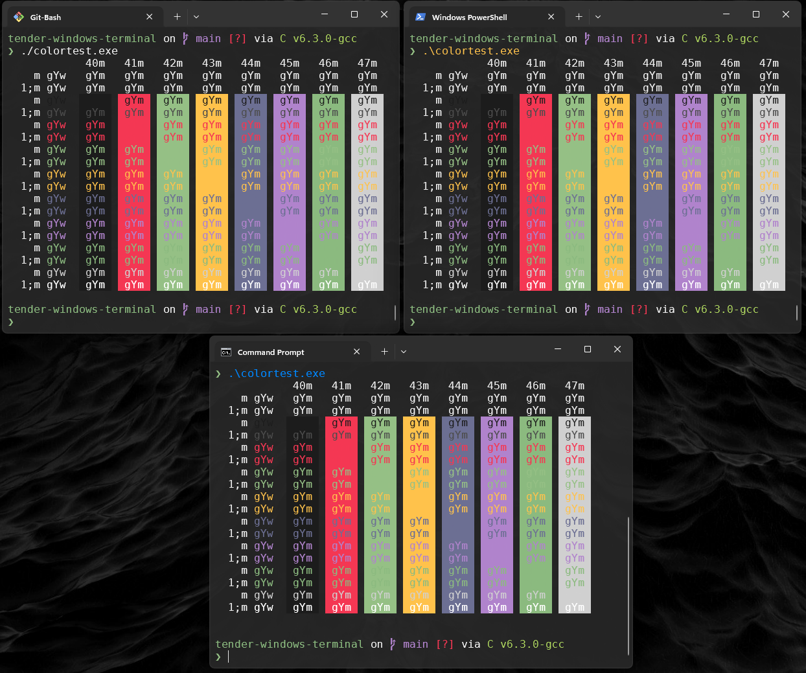

# Terminal-Agnostic-ColorTest


<div align=center>



</div>

`colorTest.c` is a simple C program designed to display various foreground and background color combinations in the terminal using ANSI escape codes. It can be run in most Unix-like shells, making it a terminal-agnostic, cross-platform color testing tool.

## Features

- Displays 8 foreground and background color combinations.
- Supports bold and normal text styles.
- Runs on any terminal that supports ANSI escape sequences.
- Useful for testing and customizing terminal color schemes.

## Prerequisites

To compile and run `colorTest.c`, you'll need:
- A C compiler such as `gcc`.
- A Unix-like environment (Linux, macOS, or WSL on Windows).
- A terminal that supports ANSI escape sequences.

## Compilation and Usage

### Compilation

1. Clone or download this repository.
2. Open a terminal and navigate to the folder containing `colorTest.c`.
3. Compile the program using the following command:

    ```sh
    $ gcc colortest.c -o colortest 
    ```
### How It Works

The program uses ANSI escape codes to control text styling and coloring in the terminal. It loops through various foreground and background colors and applies different text styles (normal and bold) to display the combinations.

- Foreground colors: `30` to `37`
- Background colors: `40` to `47`
- Text styles: Normal and Bold

The grid produced shows the ANSI codes applied to the text `gYw` and `gYm`, which lets you visually test and verify color combinations in your terminal environment.

## Compatibility

- The program is compatible with any Unix-like shell (bash, zsh, etc.) that supports ANSI escape sequences.
- It should work on macOS, Linux, and Windows Subsystem for Linux (WSL).

## Releases
You can download the latest precompiled binaries for Linux, macOS, and Windows from the Releases page.

1. Go to the Releases page.
2. Download the appropriate binary for your operating system:
   
   - colortest-linux-x86_64 for Linux
   - colortest-macos-x86_64 for macOS
   - colortest-windows.exe for Windows

3. Run the downloaded binary directly from your terminal.

## License
This project is licensed under the MIT License. See the LICENSE file for details.

## Contributions
Contributions, bug reports, and suggestions are welcome. Feel free to open an issue or submit a pull request.